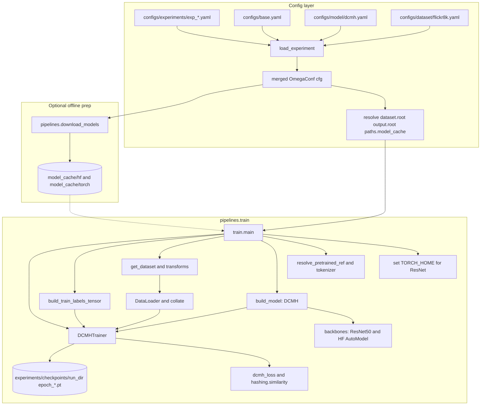

# Architecture overview

How the CM-SHC / SSHC research codebase is wired: configs, models, data, training, and offline cache.

## How the codebase works

### 1. Where configs come from

Training does not use a single monolithic YAML. The **experiment file** (e.g. `configs/experiments/exp_dcmh_flickr8k.yaml`) is a **pointer plus overrides**: it must contain `model: dcmh` and `dataset: flickr8k` (those values are **filenames without `.yaml`**).

`load_experiment()` in `src/utils/config.py` **merges**, in order:

1. **`configs/base.yaml`** — `seed`, `device`, `paths` (e.g. `model_cache`, `offline_mode`), `output.*`, `training.*`
2. **`configs/model/{model_id}.yaml`** — e.g. `configs/model/dcmh.yaml`: `model.name`, `bit_dim`, `gamma`, `eta`, `backbone.image` / `backbone.text`, etc.
3. **`configs/dataset/{dataset_id}.yaml`** — e.g. `configs/dataset/flickr8k.yaml`: `dataset.root`, `num_pseudo_classes`, `caption_max_length`
4. Whatever is **left** in the experiment file after removing `model` and `dataset` (e.g. `experiment_name`, extra `training:` overrides)

After merge, **relative paths** are resolved to absolute paths under the **repository root**: `dataset.root`, `output.root`, `paths.model_cache`.

`experiment_run_dir(cfg)` builds the run folder name from `experiment_name`, `model.name`, `dataset.name`, and `model.bit_dim` under `experiments/checkpoints/...`.

### 2. Where models come from

- **Architecture (code):** The **DCMH** module lives in `src/models/hashing/dcmh.py`. It **composes**:
  - **Image:** `ResNet50ImageEncoder` in `src/models/backbones/cnn.py` (ResNet-50 trunk + linear to hash dimension).
  - **Text:** `HFTransformerTextEncoder` in `src/models/backbones/text_encoder.py` (Hugging Face `AutoModel` + pooling + linear), unless `text_feature_dim` is set (MLP on fixed features).

- **Weights (pretrained):**
  - Text (+ tokenizer files): from the Hugging Face **repo id** in config (`model.backbone.text`), either downloaded into `model_cache/hf/...` via `src/pipelines/download_models.py` or loaded from that directory with `local_files_only` when offline (`resolve_pretrained_ref` in `src/utils/model_paths.py`).
  - Image: ImageNet ResNet weights via **torchvision**, cached under `TORCH_HOME` (training sets it to `model_cache/torch`).

- **Training objective (code):** DCMH losses are in `src/models/losses/dcmh_loss.py`; label similarity uses `calc_neighbor` in `src/hashing/similarity.py`.

- **Training loop (code):** `DCMHTrainer` in `src/core/trainer.py` owns buffers `F` / `G` / `B`, alternating image/text steps, and checkpoints.

### 3. Where data comes from

`get_dataset()` in `src/data/loaders.py` switches on dataset name (e.g. Flickr8k → `Flickr8KDCMHDataset`). Samples are dicts with `index`, `img`, `label`, `text`.

`imagenet_train_transform` in `src/data/transforms.py` builds image preprocessing.

`load_hf_tokenizer` and `make_dcmh_collate_fn` in `src/data/collators.py` turn raw captions into `input_ids` / `attention_mask` batches.

`build_train_labels_tensor` in `src/data/collators.py` builds the full label matrix for `calc_neighbor`.

### 4. Main entrypoints

| Command | Role |
|--------|------|
| `python -m src.pipelines.train --config ...` | Merge config → data → model → trainer → checkpoints under `experiment_run_dir` |
| `python -m src.pipelines.download_models --config ...` | Populate `model_cache` (HF snapshot + ResNet weights) before running on HPC without internet |
| `python -m src.pipelines.evaluate --config ... --latest` | Load checkpoint, encode dataset, report Recall@K / MRR (paired I2T and T2I); JSON under `experiments/results/` |
| `python -m src.pipelines.retrieve --config ... --latest --query-index i` | Print top-K retrieval list for one query (`--mode i2t` or `t2i`) |

### 5. Suggested reading order in code

1. `src/utils/config.py` — how YAML becomes one merged `cfg`
2. `src/pipelines/train.py` — wires config to data, model, and trainer
3. `src/models/hashing/dcmh.py` and `src/models/backbones/` — what “the model” is
4. `src/core/trainer.py` — what happens each epoch
5. `src/utils/model_paths.py` and `src/pipelines/download_models.py` — offline cache behavior

## Flowchart

